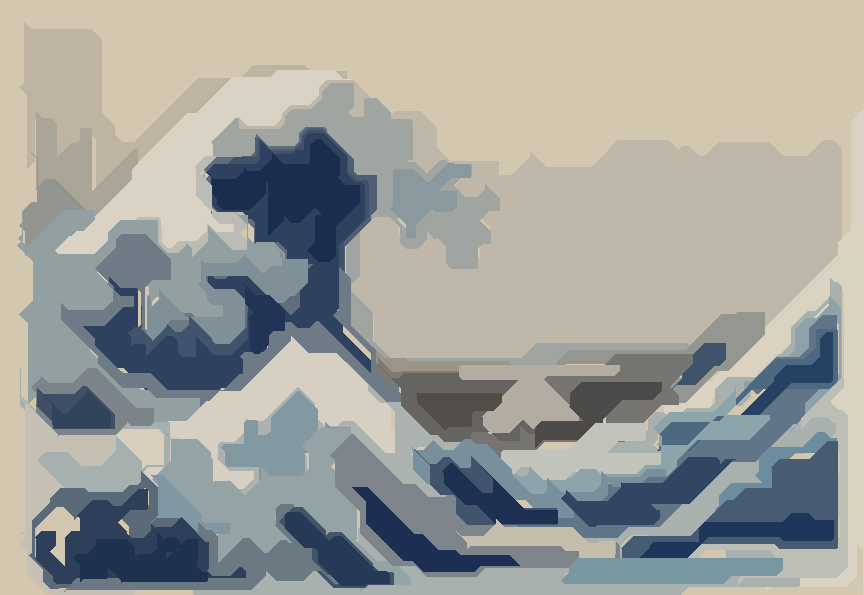
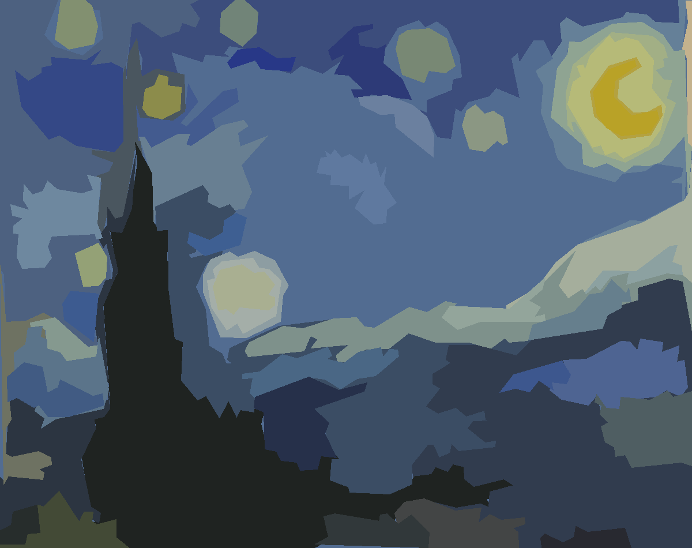

## Polygonize
An algorithm to polygonize images. Make images more concise, an effect like paper cut in photoshop. Also support to fix the direction of edges to make them more regular.



[The Great Wave off Kanagawa](https://en.wikipedia.org/wiki/The_Great_Wave_off_Kanagawa), [Katsushika Hokusa](https://en.wikipedia.org/wiki/Hokusai), 1831



 [The Starry Night](https://en.wikipedia.org/wiki/The_Starry_Night), [Vincent van Gogh](https://en.wikipedia.org/wiki/Vincent_van_Gogh), 1889

Core ideas:

* Using Superpixel to segment images
* Create region adjacency graph
* Merge adjacent regions base on certain thershold
* Extract separate fused regions and their colors
* Polygonize each area
* [Fix directions]


### Requierments
* Python 3.x
* opencv-python > 4.5
* skimage
* numpy

### Usage

```
python main.py input.jpg output.jpg [-d]
```

### Next
* Add more polygon edge diretion fix options
* SVG format support